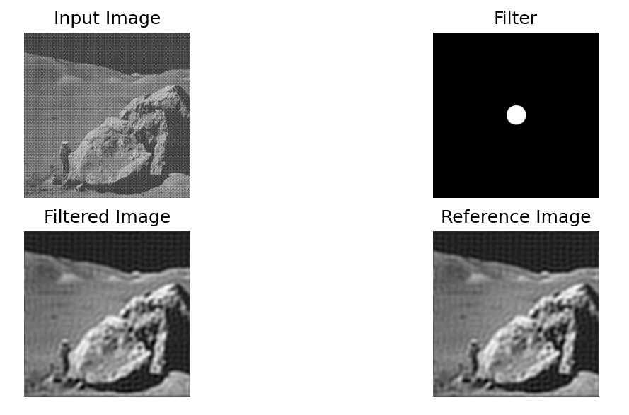

# Fourier Transform & Filtering in Frequency Domain

In this assignment, it was implemented functions in order to filter images in the frequency
domain using the Discrete Fourier Transform. The program follows the following steps:

## Read the parameters:
a) Filename for the input image ( I ).  
b) Filename for the reference image ( H ).  
c) Filter index i ∈ M = {0, 1, 2, 3, 4}.  
d) Filter Parameters respective to each index;

## Use the filters below:
a) index i = 0 - Ideal Low-pass - with radius r.  
b) index i = 1 - Ideal High-pass - with radius r.  
c) index i = 2 - Ideal Band-stop - with radius r0 and r1.  
d) index i = 3 - Laplacian High-pass.  
e) index i = 4 - Gaussian Low-pass - with σ1 and σ2;  

## Process the input images:
a) Generate the Fourier Spectrum ( F ( I ) ) for the input image I.  
b) Filter F ( I ) multiplying it by the input filter Mi.  
c) Generate the filtered image G back in the space domain.  
d) Compare the output image ( G ) with the reference image ( H ).  

## Comparing against reference

The program compares the restored image G against the reference image H.
This comparison uses the root mean squared error (RMSE).

$$ RMSE = \sqrt{\frac{\sum_i\sum_j(H(i,j) - G(i,j))^2}{M \cdot N}} $$

where $`M × N`$ is the resolution of images H and G.

## Examples

In folder `images` there are _.png_ files to test. At the end of execution, the input image I, the
restored image G, the filter used, and H images are displayed, allowing for visual comparison.

In folder `test_cases_in_out` there are files `caseX.in` and `casesX.out` where 
_.in_ contains input examples and _.out_ contains the respective output. Note that, when run
locally, RMSE values may vary by 0.75 due to specific machine errors.

To run `main.py` with an example, use that line: `python3 main.py < test_cases_in_out/caseX.in`
