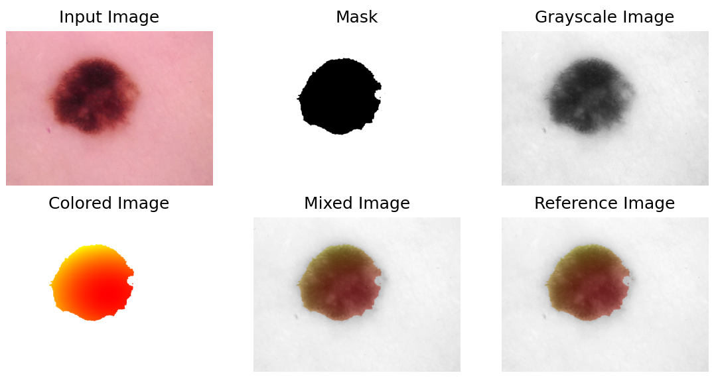

# Morphology + Color

In this assignment, functions were implemented to process images in order to identify
regions of interest (ROIs) using a heatmap. Your program must follow these steps:

## Read the parameters:
a) Filename for the input image ( I ).  
b) Filename for the reference image ( H ).  
c) Technique indexes i ∈ M = {1, 2}.  

## Implement the techniques below:
a) index i = 1 - Erosion.  
b) index i = 2 - Dilation.  
c) Adaptive Limiarization (Otsu).  

## Process the input images:
a) Convert the input image in Grayscale.  
b) Apply Adaptive Limiarization (Otsu) to binarize the image.  
c) Create the binary mask by applying the sequence of Erosions and Dilations.  
d) Create the heatmap using the given implementation.  
e) Create the colored mask as a combination of the heatmap and the binary mask.  
f) Create the image ( G ) combining the image ( I ) with the colored mask.  
g) Compare the created image ( G ) with the reference image ( H ).  

## Comparing against reference

The program compares the created image G against the reference image H.
This comparison uses the root mean squared error (RMSE).

$$ RMSE = \sqrt{\frac{\sum_i\sum_j(H(i,j) - G(i,j))^2}{M \cdot N}} $$

where $`M × N`$ is the resolution of images H and G.

Considering that images are composed of 3 channels (R, G, B), it is compute the RMSE
for each channel separately (as presented in the equation above) and calculate the average among
them.

$$ RMSE_{color} = \frac{RMSE_{red} + RMSE_{green} + RMSE_{blue}}{3} $$

## Examples

At the end of execution, the input image I, the mask, the filter used, the grayscale I,
the colored imagem, the mixed image,and H images are displayed, allowing for visual comparison.

In folder `test_cases_in_out` there are files `caseX.in` and `casesX.out` where 
_.in_ contains input examples and _.out_ contains the respective output. Note that, when run
locally, RMSE values may vary by 0.75 due to specific machine errors.

To run `main.py` with an example, use that line: `python3 main.py < test_cases_in_out/caseX.in`
